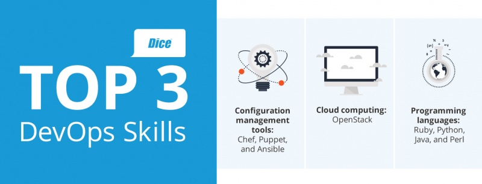
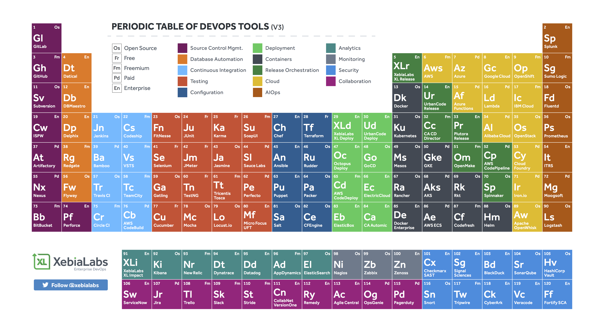

# Introduction to DevOps 

## What is DevOps?

Directly taken from: `https://landing.google.com/sre/books/`

"**[DevOps Engineers]** apply the principles of computer science and engineering to the design and development of computing systems: generally, large distributed ones. 
Sometimes, our task is writing the software for those systems alongside our product development counterparts; sometimes, our task is building all 
the additional pieces those systems need, like backups or load balancing, ideally so they can be reused across systems; and sometimes, our task is figuring out how to apply
 existing solutions to new problems."

## Tools and Skill of The Trade

# Course Overview
- Each section is broken up into modules! 
- Each module will have its associated content and activities
- All knowledge mastery questions are created in the form of copy and pastable questions for `Googability`
- Please create issues for any misleading or missing content, as well as topics you would like to see covered 
additionally or more in depth

### Table of Contents
1. [Module A - Introduction to Operating Systems ](./Module_A/README.md)
	1. `How do I work this thing called an OS?`
2. [Module B - Introduction to Linux Scripting ](./Module_B/README.md)
    1. How do I `script` in `Bash` and `Python`?
3. [Module C - Linux Scripting and Operating Systems ](./Module_C/README.md)
    1. How does the `OS influence` my `scripts`?
4. [Module D - Computer Science and Scripting ](./Module_D/README.md)
    1. How can I write `mathematically performant` scripts? 
5. [Module E - Introduction to Configuration ](./Module_E/README.md)
    1. What is the `config problem`?
6. [Module F - Advanced Configuration ](./Module_F/README.md)
    1. How can I `config` at scale `programmatically` and with `Ansible`?

---

#### [What should DevOps mean to you (potentially)?](./devops_story.md)
